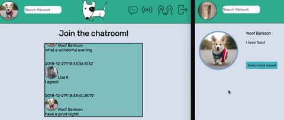

# Petwork: a social network for pet owners

Website
--------
Coming soon.

Tech stack
-------- 
- React/Redux
- Socket.io
- Node.js
- Express.js
- PostgreSQL
- AWS S3
- HTML5/CSS3

Overview
--------
#### Short description 
As a 10-day student project for SPICED Academy I built a single-page mock social network targeting pet owners. It was my first time using React and Redux.

#### Walkthrough
Upon arrival on the website you can register or log in. The password is hashed and salted before being stored in the database.

  

Once you have registered or logged in, you land on your profile page. The application will initially assign you a default profile picture. You can change the picture anytime by clicking on it. Moreover, you can add or edit your bio anytime.

  

There is an incremental search allowing you to look for other users. Once on the other user's profile you can peform different actions depending on your existing friendship status with the respective user. Possibilities include sending/cancelling a friend request, unfriending or accepting/rejecting their request.

  

The user whos is being befriended gets a notification about it in real time. When clicking on the notification you are being redirected to the profile of the user who sent the request.

  

You can also participate in a live chat. Messages that are being sent are displayed in real time.

  

Moreover, you can view the list of other online users.

  

Last but not least you can view your list of friends and friend requests.

  

Future Features
----------

- make it responsive
- exchange friendship request pop-up with a more elegant notification (e.g. a small one next to the friends icon)
